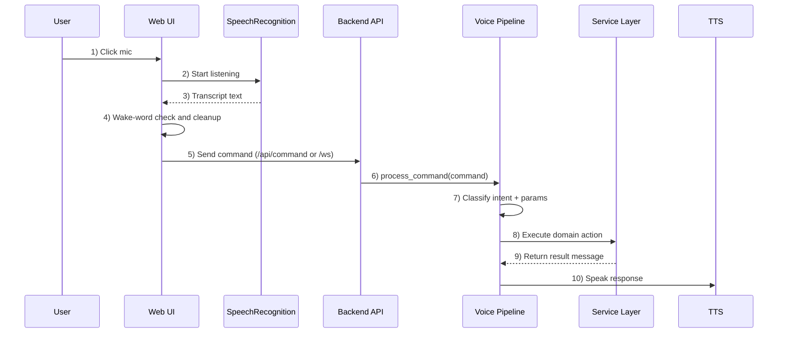

# JARVIS Complete Flow And Troubleshooting Guide

Date: 2026-04-21

## 1) What JARVIS Supports (Full Capability Map)

### Core Inputs
- Voice input from browser microphone (Web Speech API)
- Voice input from backend continuous listener (SpeechRecognition + wake word)
- Text input from UI chat/command boxes
- Direct REST API calls
- WebSocket real-time command channel

### AI Features
- AI chat with memory/context
- Quick prompt generation
- Chat reset
- Quote generation
- AI status checks

### Voice Features
- Speak text (TTS)
- Listen once (ASR one-shot)
- Start continuous wake-word listening
- Stop continuous listening
- Voice runtime status
- Language-aware behavior (en-US, hi-IN, gu-IN)

### System Features
- System info (CPU, RAM, disk, battery, IP, platform)
- Power actions (shutdown, restart, sleep, hibernate, lock, logout)
- Volume actions (up, down, mute, unmute, set level)
- Display actions
- Open app by name
- Open website by name/url
- Network details and connectivity checks
- WiFi toggle where supported

### Music and Media Features
- Play by query (or random)
- Stop, pause, resume
- Current status
- Song listing
- Music directory scan + fuzzy search

### File Features
- Create folder
- Search file
- Read file (safe limit)
- Take screenshot
- List desktop files
- Open folder

### Communication Features
- WhatsApp open/message/call pattern
- Send email via SMTP
- Contacts read/add
- Web search
- Open Gmail shortcut

### Timers and Productivity
- Set timer
- Cancel timer
- List timers
- Set alarm
- Stopwatch start/stop/read
- Calculator
- Weather

### AI Automation Features
- Smart app launcher with fuzzy suggestions
- Prompt categories and templates
- Generate and quick-generate prompts
- Clipboard read/write
- Type text into active app
- Run shell command with timeout
- Generate -> copy -> inject workflow

### Real-Time Features
- WebSocket live events for command pipeline
- Dashboard live logs and assistant status updates

---

## 2) How JARVIS Takes Input And Executes Tasks

## Path A: Browser Mic -> Command -> Action
1. User clicks mic in web UI.
2. Browser SpeechRecognition captures audio and converts to transcript.
3. UI checks wake word logic and command cleanup.
4. UI sends command to backend using HTTP or WebSocket.
5. Backend runs intent classification.
6. Pipeline routes intent to the correct service.
7. Service performs OS/API action (open app, play music, set timer, etc.).
8. Service returns a structured result.
9. Backend sends result back to UI and broadcasts event.
10. TTS speaks the response.

## Path B: Backend Wake-Word Listener -> Action
1. Backend ASR thread listens continuously.
2. Wake word is detected.
3. Next phrase is captured as command.
4. Pipeline classifies intent.
5. Service function executes action.
6. TTS speaks reply and ASR is muted during speech to avoid echo.

## Path C: Direct UI Buttons/Forms -> Action
1. UI page calls endpoint directly (example: open app button).
2. Router validates request model.
3. Service executes operation.
4. Result is shown in UI and optionally spoken.

---

## 3) How "Open App" Works Automatically

## Natural-language route
- User says: "open chrome" or types command.
- Intent classifier identifies open_app intent.
- Pipeline extracts app_name parameter.
- system_service.open_app() resolves and launches app.
- JARVIS returns and speaks success/failure message.

## Direct route
- System page sends POST /api/system/open-app.
- Router calls system_service.open_app().
- App launch happens via subprocess/startfile/open depending on OS.

## Smart automation route
- AI Automation page sends POST /api/automation/launch-app.
- ai_automation_service.launch_app() fuzzy-matches app name.
- Launch history is updated for better future suggestions.

---

## 4) How Music Search And Playback Works

1. User command like "play shape of you" arrives.
2. Intent classifier sets MEDIA intent and extracts query.
3. Pipeline routes to media handler.
4. Music service scans configured directories (if needed).
5. Fuzzy matching finds the best track.
6. Playback engine starts song.
7. Status is exposed through /api/music/status.
8. User can pause/resume/stop with dedicated endpoints.

Supported controls:
- play
- random
- pause
- resume
- stop
- status
- list songs

---

## 5) Key Implementation Files (Where Major Logic Lives)

Backend entry and orchestration
- backend/main_server.py
- backend/voice_pipeline.py

Intent and config
- backend/core/intent_classifier.py
- backend/core/config.py

Routers
- backend/routers/voice.py
- backend/routers/system.py
- backend/routers/media.py
- backend/routers/files.py
- backend/routers/communication.py
- backend/routers/timers.py
- backend/routers/ai.py
- backend/routers/settings.py
- backend/routers/ai_automation.py

Services
- backend/services/asr_service.py
- backend/services/tts_service.py
- backend/services/system_service.py
- backend/services/music_service.py
- backend/services/files_service.py
- backend/services/communication_service.py
- backend/services/timers_service.py
- backend/services/ai_service.py
- backend/services/ai_automation_service.py
- backend/services/weather_service.py

Frontend voice and API integration
- jarvis-web-ui/src/hooks/useVoice.js
- jarvis-web-ui/src/components/UI/VoiceAssistant.jsx
- jarvis-web-ui/src/utils/api.js

---

## 6) Sequence Diagram Style Flow (Mic Click -> Spoken Response, 10 Steps)

Actors:
- User
- Web UI (VoiceAssistant + useVoice)
- Backend API (main_server)
- Voice Pipeline
- Service Layer
- TTS

1. User -> Web UI: Click microphone button.
2. Web UI -> Browser SpeechRecognition: Start listening session.
3. Browser SpeechRecognition -> Web UI: Return transcript (interim/final text).
4. Web UI -> Web UI: Validate wake phrase and normalize command text.
5. Web UI -> Backend API: Send command via /api/command (or /ws command message).
6. Backend API -> Voice Pipeline: Call process_command(command_text).
7. Voice Pipeline -> Intent Classifier: Detect intent and extract parameters.
8. Voice Pipeline -> Service Layer: Route to target handler (system/music/files/timer/ai/etc.).
9. Service Layer -> Voice Pipeline: Return execution result message.
10. Voice Pipeline -> TTS -> User: Speak response, while backend also pushes result event to UI.

Sequence diagram (same 10-step flow):

---

## 7) Common Challenges And How To Fix Them

## Challenge 1: Microphone not working
Symptoms:
- No transcript
- ASR unavailable in status

Fix:
- Allow browser microphone permission.
- Install backend packages: SpeechRecognition and PyAudio.
- Check default recording device in OS settings.
- Confirm /api/voice/status shows asr_available true.

## Challenge 2: Wake word not detected reliably
Symptoms:
- Backend listens but does not trigger

Fix:
- Reduce background noise and mic distance.
- Tune energy threshold and dynamic energy in config.
- Add your common pronunciation to WAKE_WORD_ALIASES.
- Verify ASR language matches your speech language.

## Challenge 3: Echo (JARVIS hears itself)
Symptoms:
- Repeated self-trigger after speech output

Fix:
- Keep ASR mute-on-TTS enabled (already implemented).
- Use headset/earphones.
- Increase post-TTS cooldown slightly if needed.

## Challenge 4: App open command fails
Symptoms:
- "Could not open app" response

Fix:
- Try exact installed app name first.
- Use Smart Launcher endpoint for fuzzy resolution.
- Add missing executable path to app map in system_service.
- Ensure app exists or command is available in PATH.

## Challenge 5: Music search finds wrong song
Symptoms:
- Wrong track plays

Fix:
- Use more specific query.
- Update music search directories.
- Improve fuzzy threshold/logic in music service.
- Refresh library scan/cache.

## Challenge 6: AI response timeout
Symptoms:
- Delayed or fallback messages

Fix:
- Check OpenAI key and internet.
- Increase timeout for long requests.
- Reduce token/temperature load when needed.
- Add retry + fallback path (already partly present).

## Challenge 7: WebSocket not receiving events
Symptoms:
- UI does not show live assistant updates

Fix:
- Ensure backend is running on expected host/port.
- Check CORS and ws origin.
- Use HTTP fallback endpoints if ws is disconnected.

## Challenge 8: Platform-specific command issues
Symptoms:
- Works on one OS, fails on another

Fix:
- Keep per-OS command branches maintained.
- Add safe fallbacks for each operation.
- Wrap subprocess calls with error reporting and user-facing messages.

---

## 8) Hardening Checklist (Recommended)

- Add automated tests for intent extraction and router contracts.
- Add endpoint health checks for AI, ASR, TTS, music and automation.
- Add structured error codes in responses (not just messages).
- Add command audit logs for automation and system actions.
- Add permission guards for destructive operations (shutdown/restart).
- Add rate limits/debouncing for repeated voice triggers.
- Add retries with exponential backoff for external APIs.

---

## 9) Quick Run/Verify

Backend
- uvicorn backend.main_server:app --host 0.0.0.0 --port 8000 --reload

Frontend
- cd jarvis-web-ui
- npm install
- npm run dev

Quick checks
- Open /docs and confirm all routers are visible.
- Call /api/status and /api/voice/status.
- Test command: "open notepad".
- Test command: "play random song".
- Test command: "set timer for 1 minute".

---

## 10) Exact Code Locations (Feature -> File:Line)

## Backend startup and routing
- Main app + router mounting: backend/main_server.py:85-93
- WebSocket endpoint: backend/main_server.py:177
- Natural command endpoint: backend/main_server.py:300
- Chat endpoint: backend/main_server.py:317
- Startup pipeline wiring: backend/main_server.py:426-446

## Intent classification
- Intent constants: backend/core/intent_classifier.py:13
- Main classifier: backend/core/intent_classifier.py:163
- Media param extraction: backend/core/intent_classifier.py:262
- App-name extraction: backend/core/intent_classifier.py:280
- Timer param extraction: backend/core/intent_classifier.py:344
- File param extraction: backend/core/intent_classifier.py:368
- Communication param extraction: backend/core/intent_classifier.py:386
- Weather city extraction: backend/core/intent_classifier.py:399

## Voice pipeline (command routing)
- Main process pipeline: backend/voice_pipeline.py:55
- Open app route branch: backend/voice_pipeline.py:180
- Media route branch: backend/voice_pipeline.py:194
- Files route branch: backend/voice_pipeline.py:198
- Communication route branch: backend/voice_pipeline.py:208
- Timer route branch: backend/voice_pipeline.py:212
- Alarm route branch: backend/voice_pipeline.py:221
- Calculator route branch: backend/voice_pipeline.py:228
- Weather route branch: backend/voice_pipeline.py:236
- Start voice pipeline callbacks: backend/voice_pipeline.py:464

## ASR + TTS internals
- Register ASR callbacks: backend/services/asr_service.py:109
- ASR mute control (echo prevention): backend/services/asr_service.py:119
- Start ASR thread: backend/services/asr_service.py:123
- One-shot listen: backend/services/asr_service.py:143
- Continuous loop: backend/services/asr_service.py:154
- Audio capture + STT: backend/services/asr_service.py:225
- ASR singleton getter: backend/services/asr_service.py:308

- TTS mutes ASR while speaking: backend/services/tts_service.py:119
- TTS speak queue entry: backend/services/tts_service.py:171
- Language/voice apply: backend/services/tts_service.py:200
- TTS singleton getter: backend/services/tts_service.py:254

## Open app and website automation
- System app launcher: backend/services/system_service.py:384
- Website opener: backend/services/system_service.py:460
- Smart fuzzy app launcher: backend/services/ai_automation_service.py:285
- App suggestions: backend/services/ai_automation_service.py:343
- Launch history: backend/services/ai_automation_service.py:368

## Music routes and playback status
- /api/music/play route: backend/routers/media.py:22
- /api/music/stop route: backend/routers/media.py:45
- /api/music/pause route: backend/routers/media.py:52
- /api/music/resume route: backend/routers/media.py:58
- /api/music/status route: backend/routers/media.py:64
- /api/music/list route: backend/routers/media.py:69
- Music service class: backend/services/music_service.py:35
- Music status provider: backend/services/music_service.py:198
- Song listing provider: backend/services/music_service.py:221

## Frontend input and command sending
- Voice hook entry: jarvis-web-ui/src/hooks/useVoice.js:11
- Request mic permission: jarvis-web-ui/src/hooks/useVoice.js:30
- SpeechRecognition result handling: jarvis-web-ui/src/hooks/useVoice.js:60
- Start listening: jarvis-web-ui/src/hooks/useVoice.js:130
- Stop listening: jarvis-web-ui/src/hooks/useVoice.js:161

- Voice assistant sends NL command: jarvis-web-ui/src/components/UI/VoiceAssistant.jsx:400
- API helper sendNLCommand: jarvis-web-ui/src/utils/api.js:111
- API openApp call: jarvis-web-ui/src/utils/api.js:135
- API playMusic call: jarvis-web-ui/src/utils/api.js:146
- API aiChat call: jarvis-web-ui/src/utils/api.js:215
- WebSocket creator: jarvis-web-ui/src/utils/api.js:408
- WebSocket setup in layout: jarvis-web-ui/src/components/Layout/Layout.jsx:51

---

## 11) Challenge Fix Map (Where To Edit For Each Issue)

Microphone permission issue
- Check browser hook permission flow: jarvis-web-ui/src/hooks/useVoice.js:30

Wake word not reliable
- Tune wake aliases and ASR behavior: backend/services/asr_service.py:26, 154, 225
- Tune language and thresholds in config: backend/core/config.py

Echo while speaking
- ASR mute toggle from TTS: backend/services/tts_service.py:119
- ASR muted behavior in loop: backend/services/asr_service.py:154

Open app fails
- Add app mappings/fallbacks: backend/services/system_service.py:340-454
- Improve fuzzy launcher map: backend/services/ai_automation_service.py:127-211, 285

Music wrong match / playback issues
- Route logic: backend/routers/media.py:22-70
- Playback and listing internals: backend/services/music_service.py:35, 198, 221

AI timeout / slow response
- Chat endpoint timeout wrapper: backend/main_server.py:317-333
- AI service behavior: backend/services/ai_service.py

WebSocket event issues
- WS endpoint and broadcast flow: backend/main_server.py:177-258
- Frontend WS wiring: jarvis-web-ui/src/utils/api.js:408, jarvis-web-ui/src/components/Layout/Layout.jsx:51

Cross-platform command failures
- OS-specific branches: backend/services/system_service.py:112, 384, 460

---

This file is your single reference for inputs, flow, supported capabilities, automation behavior, sequence flow, exact code locations, and troubleshooting.
