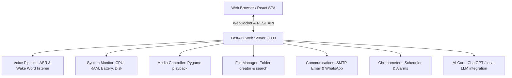

# J.A.R.V.I.S. AI Operating System (OS)

J.A.R.V.I.S. is a premium, hybrid AI-powered operating assistant. It is built as a split-process project combining a **FastAPI Python backend** for direct local hardware access with a **React (Vite + Tailwind CSS v4) frontend** styled like a responsive, dark-mode sci-fi HUD.

---

## Technical Architecture



### Why Local Setup is Required
Standard web browsers operate inside secure sandboxes. Because of this, frontend web applications cannot directly launch local terminal shells, adjust system output volume, take screenshots of your screens, or read files from your computer's local directories. 

The **FastAPI Python backend acts as an agent/bridge** running on your local computer to execute these OS-level commands safely and transmit telemetry updates back to the browser in real time.

---

## System Requirements

Before setting up, ensure your workstation has:
1. **Python 3.10 or newer** (Make sure to check "Add Python to PATH" during installation).
2. **Node.js 18.0 or newer** with **npm** (for running and compiling the frontend).

---

## Step-by-Step Local Setup

Follow these steps to run the J.A.R.V.I.S. environment locally:

### Step 1: Install Python Backend Dependencies
1. Open a terminal/CMD window in the project folder:
   ```bash
   cd d:\J.A.R.V.I.S.-Ai-Assistant-main\Dominor.py
   ```
2. Create a virtual environment (recommended):
   ```bash
   python -m venv venv
   ```
3. Activate the virtual environment:
   * **Windows (Command Prompt):**
     ```cmd
     venv\Scripts\activate.bat
     ```
   * **Windows (PowerShell):**
     ```powershell
     .\venv\Scripts\Activate.ps1
     ```
   * **macOS / Linux:**
     ```bash
     source venv/bin/activate
     ```
4. Install the required python modules:
   ```bash
   pip install -r requirements_backend.txt
   ```

*Note: The packages include `psutil` for system diagnostics, `pygame` for sound playback, `pyautogui` for screenshots, and `fastapi` with `uvicorn` for the server.*

---

### Step 2: Install React Frontend Dependencies
1. Open a second terminal window or navigate to the web UI directory:
   ```bash
   cd d:\J.A.R.V.I.S.-Ai-Assistant-main\Dominor.py\jarvis-web-ui
   ```
2. Install the node package modules:
   ```bash
   npm install
   ```

---

### Step 3: Run J.A.R.V.I.S.

You can launch both the frontend and backend servers automatically or manually:

#### Method A: Using Batch Files (Windows Quick-Start)
1. **Start Backend Only**: Run the `Start_JARVIS.bat` script located in the root workspace folder:
   * Double-click [Start_JARVIS.bat](file:///d:/J.A.R.V.I.S.-Ai-Assistant-main/Start_JARVIS.bat) to spin up the FastAPI backend on port `8000`.
2. **Start Backend + UI Servers together**: Navigate inside `Dominor.py` and execute the full launch script:
   * Double-click [Start_JARVIS_Full.bat](file:///d:/J.A.R.V.I.S.-Ai-Assistant-main/Dominor.py/Start_JARVIS_Full.bat) to spin up the Python server, install any missing modules, start the Vite developer UI server, and launch the dashboard in your default browser.

#### Method B: Manual Startup (Using Terminal)
1. **Launch Python Backend**:
   ```bash
   cd d:\J.A.R.V.I.S.-Ai-Assistant-main\Dominor.py
   uvicorn backend.main_server:app --host 0.0.0.0 --port 8000 --reload
   ```
2. **Launch React Frontend**:
   ```bash
   cd d:\J.A.R.V.I.S.-Ai-Assistant-main\Dominor.py\jarvis-web-ui
   npm run dev
   ```
3. Open `http://localhost:5173` in your web browser.

---

## Environment Variables Configuration

To unlock automated email sending (without manual copy-paste composition) and automated AI processing, add these values to your operating system environment variables or create a `.env` file inside `Dominor.py`:

* **`JARVIS_EMAIL_FROM`**: Your SMTP sender email address (e.g. `yourname@gmail.com`).
* **`JARVIS_EMAIL_PASS`**: Your SMTP app-specific password (not your master password).
* **`OPENAI_API_KEY`**: Your OpenAI API key (for GPT AI Chat features).

---

## Troubleshooting Guide

### 1. Pygame Mixer Audio Errors
If you see warnings regarding pygame sound drivers on startup:
* **Windows**: Ensure your default playback speaker device is turned on and selected.
* **Linux**: Install ALSA development library headers: `sudo apt-get install python3-dev libasound2-dev`.

### 2. PyAutoGUI Screen Recording Failures
If screenshots or app launches fail:
* **Windows**: Ensure CMD is run with standard user access permissions (do not run as Administrator unless target applications require elevated access).
* **macOS**: Give your Terminal / VS Code screen recording permissions in *System Preferences -> Security & Privacy -> Screen Recording*.
